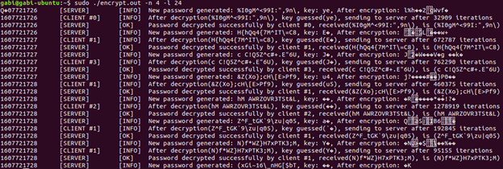
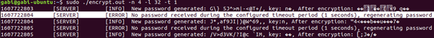

# 🧩 Blockchain & Multithreading Linux Exercises

Welcome to a Linux-based project containing two separate exercises — each focusing on a different topic, implemented using C++/C, Bash scripts, shared libraries, Makefiles, and detailed documentation.

---

## 📂 Repository Structure

This repository includes two main sub-projects:

### 🔹 [ex1](./ex1) — Bitcoin Blockchain Data Processing

- An exercise that fetches, processes, and analyzes Bitcoin blockchain data.
- Includes a Bash script to download data, C++ code to process it, and a shared library (`libinfra.so`).
- Run `make` and then execute the `blockchain1.sh` script with a number of blocks to fetch data.
- Several `.cpp` files provide different features: search, display, CSV export, and more.

📄 For full instructions, usage, and examples — see [`ex1/README.md`](./ex1/README.md)

---

### 🔹 [ex2](./ex2) — Multi-threaded Password Decryption Simulation

- A simulation where a server encrypts a password and multiple client threads try to crack it.
- Implemented in C using external libraries for encryption and random data generation.
- Each round includes a server and competing client threads. The first to decrypt the password wins.
- Thread synchronization is handled using `mutex` and `condition variables`.

💡 You must install the `mta-utils-dev-x86_64.deb` package before running.

📄 For complete details, usage examples, and notes — see [`ex2/README.md`](./ex2/README.md)

---

#### 📸 Sample Output from ex2

These screenshots show live execution of the decryption game:

##### ✅ Clients Successfully Decrypting Password

##### ⏱ Timeout Handling by Server

👉 Curious to learn more?  
Dive into [`ex2/README.md`](./ex2/README.md) for the full technical breakdown!

---

## 🛠 General Requirements

- Linux-based OS.
- Bash and G++/GCC installed.
- Basic terminal usage knowledge.
- It's highly recommended to read the README in each folder before running.

---

## 🧑‍💻 Getting Started

1. Choose a sub-project (`ex1` or `ex2`) based on your interest.
2. Read the relevant README file.
3. Install any necessary dependencies.
4. Run `make` to build the code.
5. Execute the relevant file as instructed.

Good luck! 🚀
