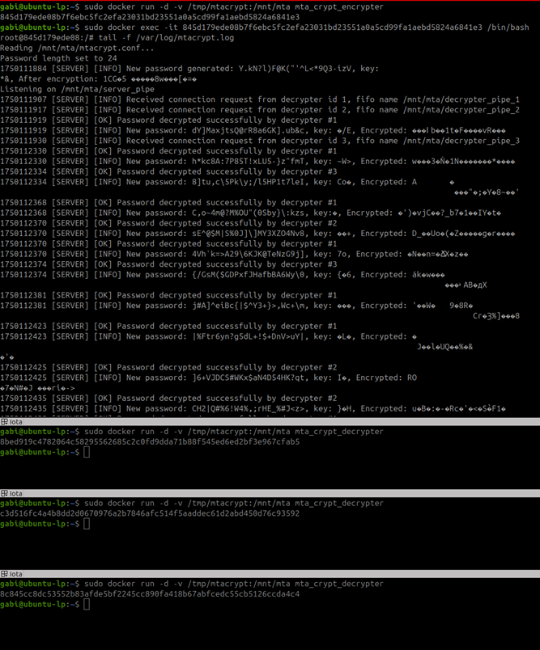
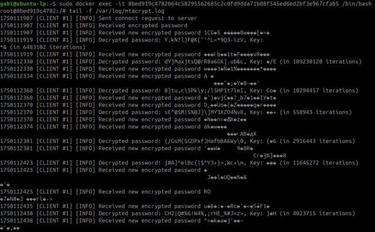
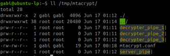

# ex3 — MtaCrypt (Containers + Named Pipes)

Run everything with a single script. **No Makefile required.** The `launcher.sh` script installs prerequisites, prepares IPC directories, builds Docker images (if needed), and starts the server and multiple clients.

---

## Overview

- **Server (encrypter)** runs in a dedicated container. It generates and rotates encrypted passwords, validates candidates sent by clients, and broadcasts the current encrypted password to all clients.
- **Clients (decrypters)** each run in their own container. On startup, a client registers with the server via its own FIFO, receives the current encrypted password, and keeps trying keys until it finds a match. When the server rotates to a new password, clients receive it and continue.
- **IPC** is implemented using **named pipes (FIFOs)** on a **shared host directory**: `host:/tmp/mtacrypt` ↔ `container:/mnt/mta`.

Screenshots for reference are included at the end of this document.

---

## Prerequisites

- Linux machine with **Docker** and **sudo** access.
- The package file **`mta-utils-dev-x86_64.deb`** placed either in the repository root or under `ex3/`.
  - The launcher installs it automatically (or prints what to do if installation fails).

---

## Quickstart (one command)

From the repository root:
```bash
chmod +x ex3/launcher.sh
./ex3/launcher.sh
```

The launcher will:
1. Install `mta-utils-dev-x86_64.deb` (if not already installed).
2. Create/refresh the host IPC directory **`/tmp/mtacrypt`** and generate a default config file:
   ```ini
   # /tmp/mtacrypt/mtacrypt.conf
   length=20
   ```
3. Build Docker images for the **server** and **client** (if missing).
4. Start the **server** and **multiple clients** (default: 3). Container names are:
   - Server: **`mta_server`**
   - Clients: **`mta_client_1`**, **`mta_client_2`**, **`mta_client_3`**

> To change the number of clients, edit the `CLIENTS=` value near the top of `launcher.sh`.

---

## Viewing Logs

**Server (stream):**
```bash
sudo docker exec -it mta_server /bin/bash -lc 'tail -f /var/log/mtacrypt.log'
```

**Client #1 (stream):**
```bash
sudo docker exec -it mta_client_1 /bin/bash -lc 'tail -f /var/log/mtacrypt.log'
```

**List running clients (names):**
```bash
sudo docker ps --format '{{.Names}}' | grep '^mta_client_'
```

**Inspect FIFOs and config on the host:**
```bash
ls -l /tmp/mtacrypt
# Expected: server_pipe, decrypter_pipe_1, decrypter_pipe_2, ..., mtacrypt.conf
```

---

## Optional: Manual Run (without the launcher)

> Normally you should use `launcher.sh`. These commands are provided for clarity and debugging.

1) Prepare host share and config:
```bash
sudo rm -rf /tmp/mtacrypt && sudo mkdir -p /tmp/mtacrypt
echo 'length=20' | sudo tee /tmp/mtacrypt/mtacrypt.conf
```

2) Build images (paths may vary depending on your Dockerfiles):
```bash
docker build -t mta_crypt_encrypter -f ex3/Dockerfile.encrypter ex3
docker build -t mta_crypt_decrypter -f ex3/Dockerfile.decrypter ex3
```

3) Start containers:
```bash
# server
sudo docker run -d --name mta_server -v /tmp/mtacrypt:/mnt/mta mta_crypt_encrypter

# clients (example: 3)
for i in 1 2 3; do
  sudo docker run -d --name mta_client_${i} -v /tmp/mtacrypt:/mnt/mta mta_crypt_decrypter
done
```

4) Tail logs:
```bash
sudo docker exec -it mta_server /bin/bash -lc 'tail -f /var/log/mtacrypt.log'
sudo docker exec -it mta_client_1 /bin/bash -lc 'tail -f /var/log/mtacrypt.log'
```

---

## Configuration

The server reads `/tmp/mtacrypt/mtacrypt.conf` on startup. Default content (auto-generated by the launcher):
```ini
length=20
```
If you change the value, restart the server/clients to apply.

---

## Troubleshooting

- **No FIFOs appear under `/tmp/mtacrypt`:** Ensure the volume is mounted (`-v /tmp/mtacrypt:/mnt/mta`) and the server is running.
- **Clients do not receive the encrypted password:** Verify that each client created its own FIFO and that the server is reading `server_pipe`.
- **Package not found or installation fails:** Place `mta-utils-dev-x86_64.deb` in the repo root or `ex3/`, then run:
  ```bash
  sudo dpkg -i mta-utils-dev-x86_64.deb || sudo apt-get -f install -y
  ```
- **Permission problems:** Run the launcher with an account that has `sudo` privileges.

---

## Cleanup

```bash
sudo docker rm -f mta_server mta_client_1 mta_client_2 mta_client_3 2>/dev/null || true
sudo rm -rf /tmp/mtacrypt
```

---

## Screenshots

- **Server + multiple clients (logs):**  
  

- **Client log stream (inside container):**  
  

- **FIFOs & config on the host (`/tmp/mtacrypt`):**  
  
